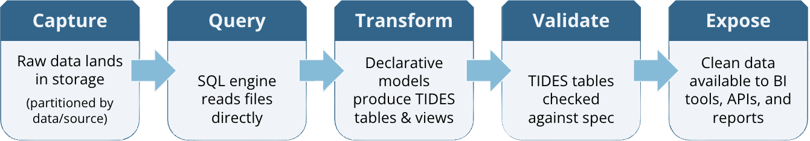
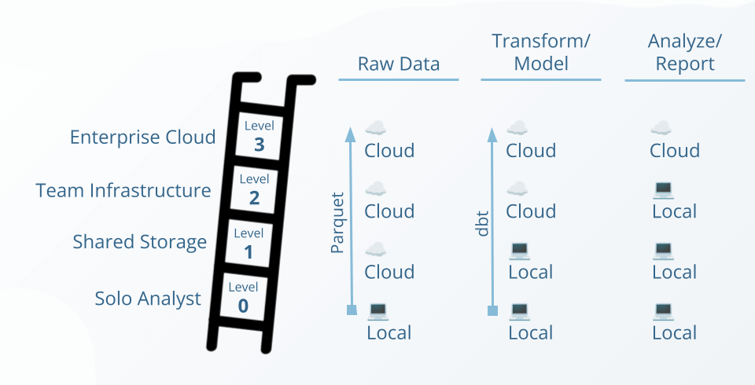

# GTFS-RT Sandbox

A sandbox environment for exploring transit operational data transformation patterns using DuckDB and dbt. Part of the **Common Transit Operations Data Framework**, this demo shows how raw operational data can be transformed into [TIDES](https://tides-transit.org/)-compliant analytics tables using architectural patterns that scale from a laptop to enterprise cloud infrastructure.

## About the Data

This sandbox uses publicly available GTFS-RT feeds as source data. In production, you would typically use raw AVL system exports which contain richer data, but GTFS-RT provides an accessible starting point for learning the patterns.

## Quick Start

### Option 1: GitHub Codespaces (Recommended)

1. Click the green "Code" button → "Open with Codespaces"
2. Wait for setup (~3 minutes, includes sample data download)
3. Run dbt:

   ```bash
   uv run dbt run
   ```

4. Query your data:

   ```bash
   duckdb sandbox.duckdb -ui
   ```

### Option 2: Local Setup

**Prerequisites:**

- [uv](https://docs.astral.sh/uv/getting-started/installation/) - Python package manager
- [DuckDB CLI](https://duckdb.org/docs/installation/) - for interactive queries

```bash
# Clone the repo
git clone https://github.com/JarvusInnovations/gtfsrt-sandbox.git
cd gtfsrt-sandbox

# Install dependencies
uv sync && uv run dbt deps

# Download sample data (~30 seconds)
uv run python scripts/download_data.py --defaults

# Run dbt to create views
uv run dbt run

# Query the data
duckdb sandbox.duckdb -ui
```

> **Note:** If you get a "Failed to download extension" error with `-ui`, see [DuckDB UI Extension Error](docs/troubleshooting.md#duckdb-ui-extension-error).

## About the Common Framework

The [TIDES specification](https://tides-transit.org/) defines what transit operational data tables should look like—but not how to build the infrastructure to produce, manage, and analyze them. The **Common Transit Operations Data Framework** bridges this gap by defining a consistent architectural pattern that works at any scale:



This same pattern applies whether you're a solo analyst on a laptop or an enterprise team in the cloud. The **maturity ladder** shows how agencies can start simple and scale up while maintaining consistent practices:



This sandbox represents **Level 0** of the maturity ladder—everything runs locally using DuckDB and dbt, but follows the same patterns you'd use at Level 3 with enterprise cloud infrastructure.

For more details, see the [TRB 2026 presentation: Introducing the Common Transit Operations Data Framework](https://docs.google.com/presentation/d/1TxG8FTjJGUh6UyTaUaZtvhGsxUwfCVPKEg5TKDXKjSw/edit?usp=sharing).

## How It Works

This sandbox uses a two-phase approach:

1. **Download data** (`download_data.py`) - fetches parquet files to `data/`
2. **Transform data** (`dbt run`) - creates views in DuckDB reading from local files

This separation keeps dbt runs fast and makes the workflow easier to understand.

## Project Structure

```
gtfsrt-sandbox/
├── data/                        # Downloaded parquet data (gitignored)
│   ├── vehicle_positions/
│   ├── trip_updates/
│   └── service_alerts/
├── models/
│   ├── staging/                 # Views reading from data/
│   │   ├── stg_vehicle_positions.sql
│   │   ├── stg_trip_updates.sql
│   │   └── stg_service_alerts.sql
│   ├── intermediate/            # Transformations
│   └── marts/                   # Analytics views
└── scripts/
    └── download_data.py         # Data download script
```

## Downloading Different Data

### See what's available

```bash
uv run python scripts/download_data.py --list
```

### Download a different agency

```bash
# Download all SEPTA systems
uv run python scripts/download_data.py --agency septa --date 2026-01-20

# Download just SEPTA bus
uv run python scripts/download_data.py --agency septa/bus --date 2026-01-20
```

### Use a different date

```bash
uv run python scripts/download_data.py --defaults --date 2026-01-20
```

See [docs/downloading_data.md](docs/downloading_data.md) for advanced options.

## Useful Commands

```bash
# Download sample data
uv run python scripts/download_data.py --defaults

# Run all models
uv run dbt run

# Run specific model
uv run dbt run --select stg_vehicle_positions

# Generate and view docs
uv run dbt docs generate && uv run dbt docs serve

# Query the database
duckdb sandbox.duckdb -ui
```

## Data Schema

For detailed schema documentation, see the [dbt docs](https://jarvusinnovations.github.io/gtfsrt-sandbox/).

## Need Help?

See [docs/troubleshooting.md](docs/troubleshooting.md) for common issues and solutions, or [open an issue](https://github.com/JarvusInnovations/gtfsrt-sandbox/issues) if you're stuck.

## License

Data sourced from public GTFS-RT feeds. Sandbox materials are MIT licensed.
